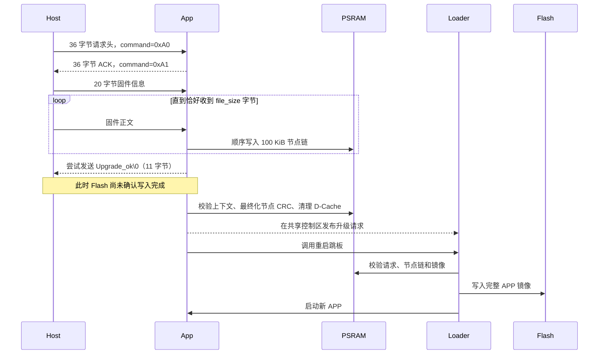

# PSRAM 暂存并由二次 Loader 写入 Flash

## 1. 模块概述

本目录提供两层接口：

- **TCP OTA 入口**：主机通过 TCP 向 APP 发送固件，APP 将固件顺序暂存到 PSRAM。
- **底层暂存接口**：TCP 以外的数据源也可以直接调用 `init -> begin -> write -> finish`，把完整 APP 镜像交给同一 PSRAM 暂存流程。

完整链路如下：

> 主机 TCP 或其他固件来源 → 运行中的 APP → PSRAM 节点链 → APP/二次 Loader 共享控制区 → 重启跳板 → 二次 Loader → Flash → 新 APP

APP 不直接把收到的镜像写入 Flash。APP 负责分配 PSRAM 节点、顺序保存镜像、累计 CRC32、最终化节点描述符、清理相关 D-Cache，并在共享控制区发布升级请求；随后调用 `rom_qspi_reboot_trampoline()`。二次 Loader 必须支持父目录协议，才能在重启后校验请求和节点链、读取完整镜像并写入 Flash。

> [!WARNING]
> TCP 返回的 `Upgrade_ok\0` 只表示 APP 已接收完整正文并准备进入交接流程，不表示二次 Loader 已经将镜像写入 Flash。收到该结果后仍不得断电，必须等待设备完成重启并确认新 APP 正常运行。

## 2. 处理时序



实际 TCP 实现中，`Upgrade_ok\0` 的发送尝试发生在 `psram_update_to_flash_app_finish()` **之前**。如果 `finish()` 随后因上下文校验或平台静默失败而返回错误，设备还会尝试发送 `Upgrade_err\0`。因此客户端可能依次收到成功和失败两个结果；当前 Python 工具读到第一个以 NUL 结尾的已知结果后即结束等待，不能把第一次收到的 `Upgrade_ok\0` 当作 Flash 升级完成证明。

## 3. 目录文件职责

| 文件 | 职责 |
| --- | --- |
| `psram_update_to_flash_app.c` | APP 侧 PSRAM 节点分配、顺序写入、CRC32、上下文校验、D-Cache 清理、共享请求发布和重启交接实现。 |
| `psram_update_to_flash_app.h` | 底层 `init/begin/write/finish/abort` API、100 KiB 节点容量、调试开关和平台静默钩子声明。 |
| `psram_update_to_flash_app_ota.c` | TCP 监听、eloop 接入、单连接 OTA 任务、0xA0/0xA1 协议收发以及 TCP 数据转入底层暂存 API。 |
| `psram_update_to_flash_app_ota.h` | TCP OTA 公共接口、命令值、默认端口和调试开关。 |
| `psram_update_to_flash_ota.py` | Python 3 主机工具，按小端协议连接设备、发送固件并读取 APP 阶段结果。 |

共享协议头位于父目录：

- `sdk/lib/ApplicationLoader/application_loader_protocol.h`
- 定义共享控制区、请求与节点结构、魔数、协议版本、CRC 覆盖长度、节点结束标记和最大节点数。

## 4. 设备端依赖和前置条件

集成前应确认目标平台具备以下条件：

1. **PSRAM 堆**：`os_malloc_psram()`/`os_free_psram()` 可用，返回的节点分配地址满足 32 字节对齐，且整个分配块位于 `[PSRAM_BASE, PSRAM_END_ADDR]`。
2. **网络栈**：TCP 入口依赖 lwIP Socket，包括 `socket/bind/listen/accept/recv/send/close`。
3. **事件循环**：依赖 `lib/net/eloop/eloop.h`；启动服务前必须完成 `eloop_init()`，并保证 `user_eloop_run` 所在任务持续运行。
4. **OS 服务**：依赖任务创建、互斥锁、内存分配、时钟节拍和日志接口。单连接 OTA 任务栈配置为 2048 字节。
5. **D-Cache 操作**：发布前调用 `sys_dcache_clean_range()` 清理各节点实际数据区和固定 32 字节描述符存储区。
6. **重启跳板**：平台必须提供 `rom_qspi_reboot_trampoline()`；`finish()` 成功路径通常调用后不返回。
7. **二次 Loader 支持**：Loader 必须与 `application_loader_protocol.h` 的版本和结构布局一致，并支持从共享控制区及 PSRAM 节点链校验、读取和写入 Flash。
8. **业务静默**：发布请求前必须停止可能继续改写 PSRAM 或影响交接的网络、媒体、存储、CPU1 业务及其他 PSRAM 使用者。

当前 TCP 服务器绑定 `INADDR_ANY`，监听 backlog 为 3，但同一时刻只处理一个 OTA 任务；忙碌期间新接入的连接会被直接关闭。

## 5. 工程集成

### 5.1 加入源文件和头文件

将以下实现加入目标 APP 工程的编译输入，并保证对应头文件及父目录协议头可被编译器找到：

- `psram_update_to_flash_app.c`
- `psram_update_to_flash_app_ota.c`
- `psram_update_to_flash_app.h`
- `psram_update_to_flash_app_ota.h`
- `../application_loader_protocol.h`

TCP 服务调用方包含：

```c
#include "lib/ApplicationLoader/psram_update_to_flash/psram_update_to_flash_app_ota.h"
```

### 5.2 初始化并运行 eloop

设备启动示例：

```c
#include "lib/ApplicationLoader/psram_update_to_flash/psram_update_to_flash_app_ota.h"

eloop_init();
os_task_create("eloop_run", user_eloop_run, NULL,
               OS_TASK_PRIORITY_NORMAL + 2, 0, NULL, 2048);
psram_update_to_flash_app_ota_server_start();
```

`psram_update_to_flash_app_ota_server_start()` 可重复调用；服务已启动时返回成功。调用者仍应检查首次调用的返回值，以识别 Socket 创建、绑定、监听或 eloop 注册失败。

现有集成点位于：

- `project/demo/fpv/txw82x/txw82xApp/app/app_fpv.c`
- 该文件包含 OTA 头文件，在 `fpv_app_init()` 中调用 `eloop_init()`、创建 `user_eloop_run` 任务，并启动 `psram_update_to_flash_app_ota_server_start()`。

## 6. 底层 API：接入 TCP 以外的数据源

包含底层头文件：

```c
#include "lib/ApplicationLoader/psram_update_to_flash/psram_update_to_flash_app.h"
```

调用顺序必须是：

1. `psram_update_to_flash_app_init()`：初始化互斥锁并清除旧控制区；可重复调用。
2. `psram_update_to_flash_app_begin(image_size)`：声明完整镜像大小并开始本轮暂存。
3. 按固件偏移顺序循环调用 `psram_update_to_flash_app_write(data, data_bytes)`。
4. 累计写入量必须与 `image_size` 精确一致，然后调用 `psram_update_to_flash_app_finish(sequence)`。
5. `begin()` 成功后，写入、大小核对或 `finish()` 失败时调用 `psram_update_to_flash_app_abort()`，清除控制区并释放本轮节点。

示例骨架：

```c
#include "lib/ApplicationLoader/psram_update_to_flash/psram_update_to_flash_app.h"

int stage_app_image(uint32 image_size, uint32 sequence)
{
    uint8 buffer[4096];
    uint32 total = 0;
    int result = -1;

    if (psram_update_to_flash_app_init() != 0) {
        return -1;
    }
    if (psram_update_to_flash_app_begin(image_size) != 0) {
        return -1;
    }

    while (has_more_data()) {
        uint32 bytes = read_next_chunk(buffer, sizeof(buffer));

        if ((bytes == 0U) || (bytes > image_size - total) ||
            (psram_update_to_flash_app_write(buffer, bytes) != 0)) {
            goto abort_update;
        }
        total += bytes;
    }

    if (total != image_size) {
        goto abort_update;
    }

    result = psram_update_to_flash_app_finish(sequence);
    if (result != 0) {
        goto abort_update;
    }

    /* 成功路径通常已通过重启跳板离开，不会执行到这里。 */
    return 0;

abort_update:
    psram_update_to_flash_app_abort();
    return -1;
}
```

`has_more_data()` 和 `read_next_chunk()` 是调用方数据源伪代码，不是本模块提供的函数。调用方应确保 `image_size - total` 的计算只在 `total <= image_size` 时进行，并保证输入数据连续、按顺序且不重复。

## 7. 覆盖平台静默弱钩子

默认弱实现直接返回 0。产品应按自身业务覆盖同名函数，在共享升级请求发布前停止其他 PSRAM 使用者：

```c
int psram_update_to_flash_app_platform_quiesce(void)
{
    /* 停止网络、媒体、存储、CPU1 业务及其他 PSRAM 使用者。 */
    return 0;
}
```

该示例只给出覆盖骨架，不虚构平台具体停止 API。实际实现必须等待相关业务确实停止后再返回。返回值只要非 0，`finish()` 就会阻止发布升级请求并返回失败；调用方随后应执行 `abort()` 或按产品策略恢复业务。

## 8. TCP 协议

默认监听端口：**TCP 20202**。

TCP 是字节流，发送端和接收端都必须处理短发送/短接收，不能假设一次调用正好完成一个协议结构。

| 顺序 | 方向 | 内容 | 长度与编码 |
| --- | --- | --- | --- |
| 1 | Host → APP | 升级请求头 | 36 字节：`command=0xA0` + 8 个 `uint32 reserved`；Python 格式 `<9I`。 |
| 2 | APP → Host | ACK 头 | 36 字节：`command=0xA1`，其余字段清零。 |
| 3 | Host → APP | 固件信息 | 20 字节：`version[16]` + `int32 file_size`；Python 格式 `<16si`。 |
| 4 | Host → APP | 固件正文 | 必须恰好为 `file_size` 字节。 |
| 5 | APP → Host | APP 阶段结果 | `Upgrade_ok\0` 为 11 字节，或 `Upgrade_err\0` 为 12 字节。 |

Python 的 `<9I` 和 `<16si` 明确使用**小端、标准尺寸、无原生对齐填充**。当前 C 端直接按目标平台本地结构布局收发，因此目标平台布局和端序必须与该工具一致。

### 8.1 `Upgrade_ok` 与 `finish` 的客观风险

当前控制流是：

1. APP 收满 `file_size` 字节，并已将正文写入 PSRAM 节点。
2. APP **先尝试**发送 `Upgrade_ok\0`。
3. APP 生成 `sequence` 并调用 `psram_update_to_flash_app_finish()`。
4. `finish()` 才执行完整上下文校验、节点 CRC 最终化、D-Cache 清理、平台静默、共享请求发布和重启跳板。
5. 如果 `finish()` 返回失败，退出路径还会尝试发送 `Upgrade_err\0`。

此外，结果发送函数忽略底层精确发送函数的返回值，因此设备不能确认 `Upgrade_ok\0` 或 `Upgrade_err\0` 已被客户端完整收到。

操作要求：

- 收到 `Upgrade_ok\0` 后继续供电，不立即判断升级最终成功。
- 等待设备重启，并通过新版本、业务健康检查或产品定义的启动日志确认新 APP。
- 如果先收到成功结果但设备未重启或新 APP 未正常运行，按“排障”章节检查 `finish`、平台静默、共享协议和 Loader 阶段。

## 9. Python 3 主机工具

在 `psram_update_to_flash` 目录执行，或使用脚本的完整路径。

### 9.1 命令示例

使用默认值：

```text
python psram_update_to_flash_ota.py 192.168.1.100 APP.bin
```

指定版本：

```text
python psram_update_to_flash_ota.py 192.168.1.100 APP.bin --version V2.7.0
```

指定端口和超时：

```text
python psram_update_to_flash_ota.py 192.168.1.100 APP.bin --port 20202 --connect-timeout 10 --result-timeout 30
```

也可调整发送分块：

```text
python psram_update_to_flash_ota.py 192.168.1.100 APP.bin --chunk-size 65536
```

### 9.2 参数

| 参数 | 含义 | 默认值/限制 |
| --- | --- | --- |
| `host` | 设备 IPv4 地址或主机名。 | 必填。 |
| `firmware` | APP 固件文件路径。 | 必填；必须存在且非空。 |
| `--version` | 写入 16 字节版本字段。 | 默认 `APP`；UTF-8 编码后最多 15 字节，保留 1 字节 NUL。限制按字节而不是字符数计算。 |
| `--port` | 设备 TCP 端口。 | 实际默认值为 `20202`；范围 `1~65535`。 |
| `--connect-timeout` | 建连，以及 ACK 接收和固件正文发送阶段使用的 Socket 超时秒数。 | 默认 `10` 秒。 |
| `--result-timeout` | 固件发送完成后等待结果的超时秒数。 | 默认 `30` 秒。 |
| `--chunk-size` | 主机读取并发送固件的分块字节数。 | 默认 `65536`，必须大于 0。 |

工具允许的最大固件文件大小为 `0x7FFFFFFF` 字节；该上限来自 20 字节固件信息中的有符号 `int32 file_size`。实际可升级大小还受设备 PSRAM 容量、节点上限和 Loader/Flash 布局约束。

> [!NOTE]
> 默认 TCP 端口为 `20202`；可通过 `--port` 覆盖，合法范围为 `1~65535`。

### 9.3 主机端结果解释

Python 工具收到第一个 `Upgrade_ok\0` 后会结束结果等待，并打印设备已接收固件、升级期间不要断电。该输出对应 APP 接收阶段，不构成 Loader 已完成 Flash 写入的确认。工具没有继续等待设备重连，也没有验证新 APP 版本。

## 10. 资源需求和限制

### 10.1 PSRAM 节点

- 每个节点的数据区容量：`100 * 1024` 字节，即 100 KiB。
- 每次节点分配：数据区之外固定预留 32 字节描述符存储区，因此分配块为 `32 + 100 KiB`。
- 协议节点结构实际为 28 字节，但数据区固定从分配块偏移 32 字节开始。
- 最大节点数：4096。
- 节点按固件偏移顺序链接；除最后一个节点外，非末节点必须满载 100 KiB。
- 最后一个节点也按完整的 `32 + 100 KiB` 分配块申请。

仅计算模块节点分配块时，镜像所需 PSRAM 约为：

$$
\left\lceil\frac{\text{image\_size}}{102400}\right\rceil \times 102432\ \text{字节}
$$

还应给 PSRAM 堆分配器元数据、对齐、碎片以及设备中其他 PSRAM 使用者留出余量。4096 个节点只是协议上限，不代表实际设备具有对应容量。

### 10.2 传输和并发限制

- `begin()` 声明的大小必须大于 0。
- `write()` 只能顺序追加，累计写入不得超过声明大小。
- `finish()` 要求累计写入量与声明大小精确相等。
- 当前协议不携带分块偏移，不支持乱序、重复块修正或断点续传；失败后应从完整镜像重新开始。
- 同一时刻只允许一个 TCP OTA 任务；忙碌时关闭新连接。
- TCP 正文接收使用 1460 字节 SRAM 缓冲。
- 接收进度日志每累计 100 KiB 输出一次。

### 10.3 交接约束

- APP 发布前清理节点数据区和描述符的 D-Cache，Loader 必须按共享地址读取。
- 平台静默钩子必须阻止其他 CPU、任务或外设继续使用或改写相关 PSRAM。
- 升级请求通过共享控制区跨重启交给二次 Loader；APP 与 Loader 必须使用一致的协议版本和结构布局。
- 从发布、重启、Loader 校验到 Flash 写入完成期间不得断电。

## 11. 安全和能力边界

当前目录中的 TCP 服务、底层暂存实现和 Python 工具没有提供以下能力：

- TCP 身份认证或访问控制；
- TLS 加密；
- 固件数字签名或发布者身份验证；
- 断点续传；
- 本模块内可见的 Flash 回滚策略；
- 主机工具对重启后新 APP 版本的自动确认。

CRC32 用于检测请求、节点头和镜像数据不一致，不等同于密码学签名。产品部署时应由系统架构在本模块之外补充网络隔离、访问控制、可信固件验证和失败恢复策略，不能把这些能力视为本模块已经实现。

## 12. 调试日志

两个日志开关默认均为 1：

| 宏 | 日志范围 | 典型前缀 |
| --- | --- | --- |
| `PSRAM_UPDATE_TO_FLASH_APP_DEBUG` | PSRAM 节点、CRC、校验、Cache、发布和 abort。 | `[ApplicationLoader][PSRAM]` |
| `PSRAM_UPDATE_TO_FLASH_APP_OTA_DEBUG` | TCP 监听、连接、协议、接收进度和结果。 | `[PSRAM Update][TCP]` |

服务启动还有不受上述 `LOG_D` 宏前缀约束的提示：

- `ApplicationLoader TCP OTA server started: port=20202`
- `ApplicationLoader TCP OTA server create failed: port=20202`

完整接收正文后会打印：

- `ApplicationLoader TCP OTA received: version=..., size=...`

发布请求后会打印：

- `PSRAM update request ready: size=..., nodes=..., sequence=...`

最后一条日志表示 APP 已发布共享请求并准备调用重启跳板，仍不是 Flash 写入完成证明。

## 13. 排障

| 现象 | 检查项与处理 |
| --- | --- |
| 服务启动失败 | 查看 `socket create failed`、`bind/listen failed`、`eloop add fd failed` 或无前缀的 create failed 日志；确认 lwIP 已初始化、端口 20202 未冲突、eloop 已初始化且可注册事件。失败后不要继续运行主机工具。 |
| 主机无法连接 | 确认设备 IP、路由、防火墙和 TCP 20202；确认设备打印 server started；当前服务绑定 `INADDR_ANY`。若已有 OTA 任务，新连接会被立即关闭，应等待当前任务退出后重试。 |
| ACK 命令错误或 ACK 长度不足 | 确认请求为小端 `<9I`、总长 36 字节且第一个字段为 0xA0；主机必须精确读取 36 字节，并验证首字段为 0xA1。检查主机与目标端序/结构布局是否一致。 |
| Python 报版本过长 | `--version` 的 UTF-8 编码必须不超过 15 字节；中文等多字节字符不能按字符数估算。缩短版本字符串后重试。 |
| PSRAM 节点分配失败 | 查看 PSRAM 空闲量、碎片、32 字节对齐和地址范围；按节点公式估算需求，并在传输前释放非必要 PSRAM 占用。节点分配失败会清控制区并释放本轮节点，必须重新开始完整传输。 |
| 传输中断或主机超时 | 检查 `recv exact failed`、`firmware recv failed`、`PSRAM write failed`。正文接收或写入失败会执行 `abort()`；当前无断点续传，应修复网络或资源问题后从 0 重新发送。 |
| `finish` 校验失败 | 确认底层调用方声明大小非零、写入顺序连续、累计字节数精确等于 `image_size`，且节点未被其他业务改写；查看 `finish validation failed`。失败后调用 `abort()`，不要手工发布共享 magic。 |
| 平台静默失败 | 查看 `platform quiesce failed`；覆盖钩子应真正停止相关业务，成功返回 0。非 0 会阻止发布请求。修复钩子后重新开始升级。 |
| 主机先收到成功又遇到失败 | 这是当前 `Upgrade_ok` 先于 `finish` 的可能结果。不要按第一次成功结果判定最终状态；检查设备 `finish` 和平台静默日志，并确认是否进入 Loader。 |
| 收到成功但设备未正常升级 | 保持供电；检查是否出现 request ready 和重启，核对 APP/Loader 的 `application_loader_protocol.h` 版本与布局，确认 Loader 能校验 PSRAM 节点并写 Flash。随后检查新 APP 启动。`Upgrade_ok` 本身不能证明 Flash 已写完。 |
| Loader 校验或 Flash 写入失败 | 本目录 APP 侧只能证明已发布请求。应查看二次 Loader 的诊断输出，检查请求头 CRC、节点头 CRC、整镜像 CRC、节点地址范围、Flash 擦写和目标分区；不要反复断电重试。 |

## 14. 构建说明

将本模块加入具体产品工程后，应使用该工程既有的编译、链接和镜像生成流程验证依赖与符号是否齐全。本 README 的创建不包含对既有编译问题的修复，也不代表当前工作区或 FPV 工程已经构建通过。
